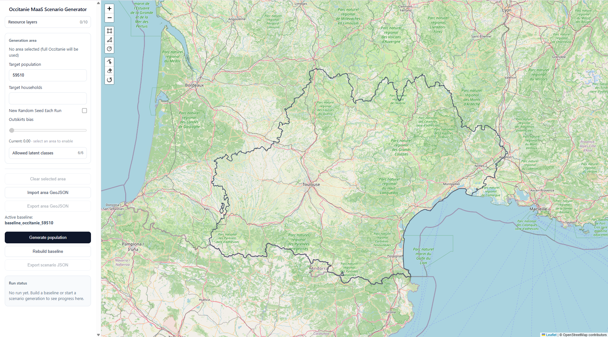

# Occitanie MaaS Scenario Generator (based on eqasim-france)

This repository is my adaptation of `eqasim-france` focused on an Occitanie MaaS workflow:
- generating scenario populations from a stored Occitanie baseline with the ability to control these scenarios through an interface
- assigning latent classes and preferences from `profiles.yml`
- exporting scenario outputs (`scenario.json` and CSV layers) for map-driven analysis

## Documentation

- [Occitanie MaaS documentation](https://fayadd21.github.io/occitanie-maas-scenario-generator/)
- [Original eqasim-france documentation](https://eqasim-org.github.io/eqasim-france)

## Acknowledgments

This project builds directly on the open-source work of the `eqasim-france` creators and contributors.
Many thanks to Sebastian Horl, and the broader eqasim community for the original methodology, codebase, and documentation.

## Main reference

The main research reference for the synthetic population of Île-de-France is:
> Hörl, S. and M. Balac (2021) [Synthetic population and travel demand for Paris and Île-de-France based on open and publicly available data](https://www.sciencedirect.com/science/article/pii/S0968090X21003016), _Transportation Research Part C_, **130**, 103291.

## Publications

- Hörl, S. and M. Balac (2021) [Synthetic population and travel demand for Paris and Île-de-France based on open and publicly available data](https://www.sciencedirect.com/science/article/pii/S0968090X21003016), _Transportation Research Part C_, **130**, 103291.
- Hörl, S. and M. Balac (2021) [Open synthetic travel demand for Paris and Île-de-France: Inputs and output data](https://www.sciencedirect.com/science/article/pii/S2352340921008970), _Data in Brief_, 107622.
- Hörl, S., M. Balac and K.W. Axhausen (2019) [Dynamic demand estimation for an AMoD system in Paris](https://ieeexplore.ieee.org/document/8814051),
paper presented at the 30th IEEE Intelligent Vehicles Symposium, Paris, June 2019.
- Hörl, S. (2019) [An agent-based model of Île-de-France: Overview and first results](https://slides.com/sebastianhorl/matsim-paris), presentation at Institut Paris Region, September 2019.
